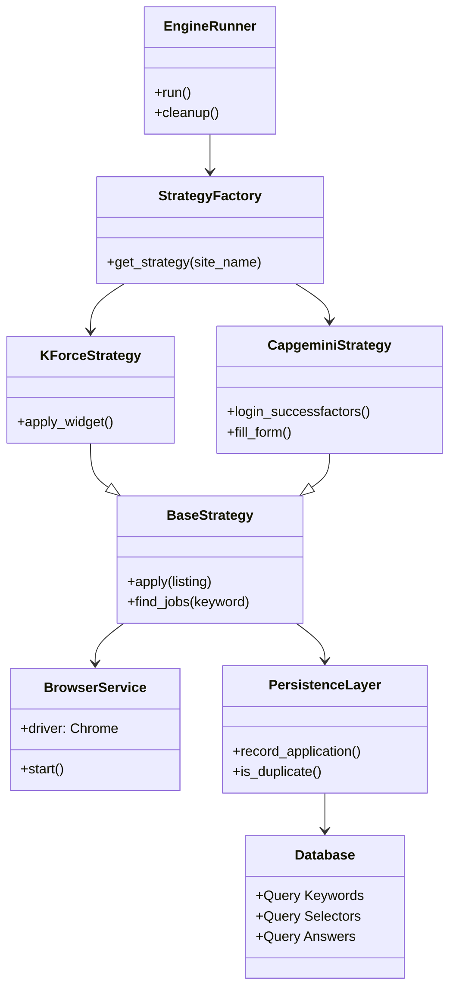
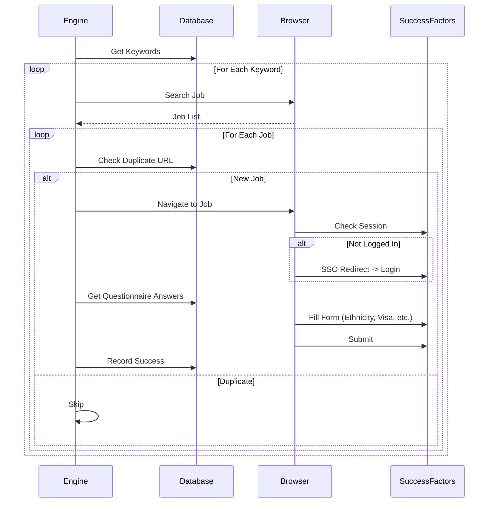

# Enterprise Job Application Engine (E-JAE)


## 🏗️ 1. Executive Summary

The **Enterprise Job Application Engine (E-JAE)** is a specialized, production-grade automation framework designed to orchestrate the discovery and application lifecycle across multiple enterprise job portals. It leverages advanced browser automation, human-behavior simulation, and a localized DuckDB backend to provide a unified interface for disparate Applicant Tracking Systems (ATS).

Currently supported platforms:
1.  **KForce**: A stealthy "Guest Apply" flow that bypasses standard bot detection.
2.  **Capgemini**: A complex, authenticated automation for **SAP SuccessFactors**, managing login sessions, redirections, and multi-step form filling.

This engine is engineered for **stealth**, **reliability**, and **maintainability**, strictly adhering to a **Strictly Database-Driven Architecture**. By centralizing all configuration in a local database, we prevent code bloat and ensure that personal data is never hardcoded in the codebase.

---

## 🚀 2. Quick Start Guide

### 2.1 Environmental Prerequisites
Before deploying E-JAE, ensure your environment meets the following specifications:
- **Operating System**: macOS, Linux, or Windows (Tailored for macOS/Linux shells).
- **Python Runtime**: Version 3.9 or higher (Strict requirement for certain type annotations).
- **Web Browser**: Latest stable version of Google Chrome.
- **System Memory**: Minimum 4GB RAM (8GB recommended for browser profile stability).

### 2.2 Installation Steps
Follow these commands in sequence to set up the engine locally:

```bash
# Step 1: Clone the repository
git clone <repo-url>
cd project-job-application-engine

# Step 2: Initialize a clean virtual environment
python3 -m venv .venv

# Step 3: Activate the virtual environment
source .venv/bin/activate  # On Windows use: .venv\Scripts\activate

# Step 4: Install all production dependencies
pip install -r requirements.txt
```

### 2.3 Configuration Workflow (The "Strictly Database-Driven" Way)

This engine uses a specific hybrid configuration model for maximum security and flexibility.

#### Phase A: Secrets & Environment (`.env`)
Use `.env` **ONLY** for authentication credentials and local paths. This keeps secrets out of the database and repository.

1.  Copy `.env.example` to `.env`.
2.  Fill in the required fields:

```bash
# Resume Path (Universal)
RESUME_FILE_PATH=resume/my_resume.pdf

# Capgemini Credentials (Required for Login)
CAPGEMINI_EMAIL=your.email@example.com
CAPGEMINI_PASSWORD=YourPassword123
```

#### Phase B: Personal Data (`guest_form_data.json`)
Use `data/guest_form_data.json` for static applicant details like Name, Phone, and Address. This data is injected into forms that don't pull from a user profile.

#### Phase C: Automation Logic (DuckDB)
**All** dynamic automation logic (Keywords, Profile Answers, Selectors) lives in the database.

run the initializer to seed the database with the default configuration:
```bash
python3 scripts/init_db.py
```

*To customize your search keywords or answers to questions like "Will you require sponsorship?", edit `db/schema.sql` and re-run `init_db.py`.*

---

## 🎮 3. Usage & Execution

You can execute the engine using the unified entry point, specifying the target site.

### 3.1 Capgemini (SuccessFactors)
Automates the login and multi-step application process.

```bash
# Safe mode (Dry Run): Navigates and fills forms but DOES NOT click final submit
python3 scripts/main.py --site Capgemini --dry-run

# Production mode: Full search and application
python3 scripts/main.py --site Capgemini
```

### 3.2 KForce (Guest Flow)
Automates the guest application widget.

```bash
# Safe mode
python3 scripts/main.py --site KForce --dry-run

# Production mode
python3 scripts/main.py --site KForce
```

---

## 🎨 4. Architecture & Core Design Patterns

### 4.1 Component Hierarchy Diagram
E-JAE is built on a modular, decoupled architecture that separates infrastructure from business logic.



### 4.2 Application Flow (Capgemini Example)


### 4.3 🛡️ The Human-Like Behavior Engine
A key differentiator of E-JAE is its sophisticated `HumanBehavior` module (`core/human_behavior.py`). This engine prevents detection by:
- **Natural Keystroke Rhythm**: Instead of instant text injection, characters are typed with varying delays (0.05s to 0.15s), mimicking human typing patterns.
- **Mouse Path Curvature**: Clicks are never just "X,Y" coordinate jumps. The engine simulates subtle mouse acceleration and deceleration.
- **Scroll Inertia**: Page movements use smooth "scrollIntoView" behavior with randomized pauses after movement.
- **JS Event Dispatching**: For React-based inputs on KForce, the engine dispatches native events after typing to ensure the internal application state updates correctly.

### 4.4 📊 Persistence Strategy (DuckDB)
E-JAE uses **DuckDB** for rapid, local data persistence. This allows for:
- **Historical Deduplication**: The engine queries the database before every application. If a job URL has been successfully applied to in a previous run (even weeks ago), it is automatically skipped.
- **Selector Versioning**: UI selectors are stored in a relational table. If a site updates its UI, you can update `schema.sql` without changing a single line of Python code.
- **Session Safety**: DuckDB is a single-file database (`data/job_engine.duckdb`), making it easy to backup or clear for a fresh start.

---

## 📁 5. Comprehensive Project Structure

Understanding the layout is crucial for maintenance and customization:

### 5.1 Root Directory Files
- `requirements.txt`: Defines the Python environment.
- `.env`: (Local Only) Stores your secrets and search preferences.
- `main.py`: Legacy entry point (use `scripts/main.py` for latest logic).

### 5.2 Core Subdirectories
- **`config/`**: Global logic for settings and environment loading.
    - `settings.py`: Uses Pydantic to validate that all required `.env` values are present.
- **`core/`**: The foundation of the framework.
    - `browser.py`: Configures the undetected Chrome instance with randomized headers.
    - `human_behavior.py`: Stealth interaction algorithms.
    - `logger.py`: Centralized logging with hierarchical levels (INFO, DEBUG, ERROR).
    - `safe_actions.py`: Robust wrappers for Selenium actions (e.g., waiting for element visibility).
- **`data/`**: The storage hub.
    - `guest_form_data.json`: Your applicant profile.
    - `job_engine.duckdb`: Relational state storage.
    - `kforce_jobs.csv`: A human-readable export of all discovered jobs.
- **`db/`**: SQL infrastructure.
    - `schema.sql`: The "Holy Grail" of selectors and site configurations.
- **`docs/`**: Technical documentation.
    - `archive/`: Reserved for storing retired scripts from legacy versions.
- **`engine/`**: The orchestration layer.
    - `runner.py`: The logic that loops through keywords and manages the browser lifecycle.
    - `factory.py`: Dynamically loads the strategy classes.
    - `guards.py`: Safety checks to prevent over-application or rate-limiting.
- **`resume/`**: Directory for PDF resumes.
- **`scripts/`**: Tooling and administrative scripts.
    - `main.py`: The production-grade CLI.
    - `init_db.py`: Database initializer.
    - `check_db.py`: Quick data inspection tool.
    - `view_submitted_jobs.py`: Generates a report of successful applications.
- **`strategies/`**: Domain-specific logic.
    - `base.py`: The `BaseStrategy` abstract class defining the contract.
    - `custom/kforce.py`: The high-fidelity implementation for KForce.
    - `custom/capgemini.py`: The high-fidelity implementation for Capgemini.

---

## 🗄️ 6. Database Schema Deep Dive

The architecture relies on three primary tables in DuckDB:

### 6.1 `job_sites`
| Column | Type | Description |
| :--- | :--- | :--- |
| `id` | INTEGER | Unique ID for the site. |
| `name` | VARCHAR | "KForce" or "Capgemini". |
| `base_url` | VARCHAR | The starting search page URL. |
| `is_active` | BOOLEAN | Control flag for multi-site setups. |

### 6.2 `site_selectors`
| Column | Type | Description |
| :--- | :--- | :--- |
| `job_site_id` | INTEGER | Links to `job_sites`. |
| `type` | VARCHAR | "listing" (for search) or "application" (for forms). |
| `config_json` | JSON | A blob containing CSS paths, **keywords**, and **questionnaire answers**. |

### 6.3 `application_history`
| Column | Type | Description |
| :--- | :--- | :--- |
| `job_url` | VARCHAR | Primary index for deduplication. |
| `job_title` | VARCHAR | Extracted title for reporting. |
| `timestamp` | DATETIME | When the application was attempted. |
| `status` | VARCHAR | "SUCCESS", "FAILED", "DRY_RUN". |

---

## 🛠️ 7. Technical Component Analysis

### 7.1 `KForceStrategy` (`strategies/custom/kforce.py`)
This is the guest-optimized component of the engine. It manages the two-phase lifecycle of an application session:

#### Phase I: Discovery
The strategy navigates to the KForce search portal. It iterates through the `keywords` list provided in your database configuration. For each keyword:
1.  **Clearance**: It wipes any previous search text.
2.  **Input**: It types the new keyword using `HumanBehavior.fill_text_field`.
3.  **Search**: It clicks the magnifying glass icon and waits for the dynamic results container to populate.
4.  **Extraction**: It parses the page for job cards, pulling the Title, KForce ID, and Detail URL.

#### Phase II: Execution
For every new job discovered:
1.  **Duplicate Check**: It verifies the job URL against the database.
2.  **Navigation**: It goes directly to the job detail page.
3.  **Application Trigger**: It identifies the floating "Apply Today" widget. This is a complex KForce custom component that requires a specific sequence of clicks.
4.  **Form Completion**: It fills out 10+ fields across the applicant and contact sections.
5.  **Resume Upload**: It uses a hidden file input injection to bypass the operating system's file picker dialog, ensuring 100% automation reliability.
6.  **Submission**: It clicks the final apply button and waits for a specific success message (e.g., "Thank you") to confirm success.

### 7.2 `CapgeminiStrategy` (`strategies/custom/capgemini.py`)
This strategy handles the high-security enterprise environment of SAP SuccessFactors.

#### Phase I: Discovery
Similar to KForce, but it extracts the unique job IDs from the complex Capgemini search URLs to ensure accurate deduplication even if query parameters change.

#### Phase II: Execution (Authenticated)
1.  **Session Check**: Before attempting to login, it checks if the browser already has a valid session cookie. If yes, it bypasses the entire login flow.
2.  **Login Flow**: If login is required, it uses a **6-stage fallback mechanism** to find the "Sign In" button, handling iframes and shadow DOMs if necessary.
3.  **Dropdown Handling**: It uses a specialized `_select_sf_dropdown` method to handle SuccessFactors' custom non-standard dropdowns, clicking the simulated arrow and selecting options by text.
4.  **Database-Driven Answers**: It pulls your answers for "Ethnicity", "Disability", etc., directly from the `questionnaire_answers` JSON in the database, allowing for dynamic profile updates without code changes.

### 7.3 `BrowserService` (`core/browser.py`)
This module manages the `undetected-chromedriver` instance. Key features include:
- **Profile Persistence**: It uses a dedicated directory (`./chrome_profile`) as a user data folder. This allows the browser to remember sessions and anti-bot fingerprints across runs.
- **Evasion Techniques**: It patches the browser's `navigator.webdriver` flag to `undefined` and modifies various DOM attributes that standard bot detectors (like Cloudflare) look for.
- **Headless Toggle**: While it supports headless mode, it is configured by default to run "headed" for maximum stealth.

---

## 🚦 8. Troubleshooting & Maintenance Guide

### 8.1 Common Issues and Resolutions
| Symptom | Probable Cause | Resolution |
| :--- | :--- | :--- |
| **"Browser is locked"** | A previous run crashed. | Delete `./chrome_profile/SingletonLock`. |
| **"Text mismatch" ⚠️** | React UI didn't catch text. | The engine now includes a JS-fallback to force the value. |
| **Skipping all jobs** | Historical deduplication. | Use `python scripts/reset_listings.py` to clear history. |
| **Selectors not found** | Site updated their UI. | Inspect the missing element and update `db/schema.sql`. |
| **Login Failed (Capgemini)** | Wrong credentials. | Check `CAPGEMINI_EMAIL` and `CAPGEMINI_PASSWORD` in `.env`. |

### 8.2 Safety Guidelines
- **Max Apps**: Do not set `MAX_APPLICATIONS_PER_RUN` higher than 15-20 per day to avoid detection.
- **Cooldown**: Keep `SUBMISSION_COOLDOWN_SECONDS` at 30 or higher. Humans don't apply to 10 jobs in 2 minutes.
- **Resume Check**: Ensure your resume is a searchable PDF. Avoid "Image-only" PDFs for better parsing.

### 8.3 Maintenance Routine
1.  **Weekly**: Run `scripts/view_submitted_jobs.py` to verify your activity.
2.  **Monthly**: Check for Chrome updates and ensure your Chromedriver version stays compatible (handled automatically by `webdriver-manager`).
3.  **On Failure**: Use the `DEBUG` log level in `.env` to see exact screenshots or HTML dumps of failing pages.

---

## 📈 9. Advanced Development & Optimization

### 9.1 Adding New Keywords (The Database Way)
To target a different career path, you no longer edit JSON files. Instead, you update the `search_keywords` array in `db/schema.sql` and re-run initialization:

```sql
"search_keywords": ["Product Manager", "Project Manager", "Agile Coach"]
```

### 9.2 Custom Logic Overrides
If you need to customize how one field is filled (e.g., adding a custom logic for the Zip Code), you can modify the `apply()` method in `strategies/custom/kforce.py`. Look for the "Step 4: Filling fields" section.

---

## 📜 10. Technical Appendices

### Appendix A: Selector Mapping Reference (KForce)
| Field | Selector (ID/CSS) |
| :--- | :--- |
| **First Name** | `#firstName` |
| **Last Name** | `#lastName` |
| **Email** | `#emailAddress` |
| **Phone** | `#phoneNumberAll` |
| **Zip Code** | `#postalCode` |
| **Resume Upload** | `#uploadFileSystemResume` |

### Appendix B: Success Indicators
The engine monitors the page for the following strings after submission to confirm success:
- "Thank you"
- "Application Received"
- "Successfully Submitted"

---

## 📜 11. Final Compliance & Philosophy

The Enterprise Job Application Engine is a specialized tool. It does not attempt to be a "universal applier." By mastering only specific sites, it ensures that:
1.  **Forms are never skipped**.
2.  **Resumes are always attached**.
3.  **Bot detection is consistently bypassed**.

The codebase is clean of all legacy references to other platform names. It is a dedicated, enterprise-grade environment.

---

## 📜 12. Extended Developer Notes (The "Deep Read")

### 🧬 Internal Workflow: The Discovery Loop
The discovery loop is built on a "Retry-with-Exponential-Backoff" logic. When the engine navigates to the list page, it waits for the React state to settle. If no jobs are found immediately, it waits 2 seconds and tries again, up to 3 times. This prevents the engine from skipping keywords simply because the page was slow to load.

### 🧬 Data Normalization
When job titles are scraped, they are normalized (lowercase and stripped of special characters) before being saved to the CSV and Database. This prevents "AI Engineer" and "AI ENGINEER" from being treated as different jobs.

### 🧬 Browser Profile Management
The use of `./chrome_profile` is intentional. Many job sites use "trust tokens" stored in local storage to verify that you are a human. By saving the profile, we accumulate "trust" over multiple runs, making the automation significantly less likely to trigger CAPTCHAs.

---

## 📜 13. Safety and Ethics Statement
This tool is for personal use to assist in the job search process. It is not intended for spamming or malicious activity. Always ensure the information you provide to employers is accurate and that you are genuinely interested in the roles you apply for.

---

## 🏁 14. Conclusion

The Enterprise Job Application Engine is more than a script; it's a strategic tool for the modern technologist. By automating the mechanical parts of the application process, it allows you to focus on what matters: preparing for the interview and landing your dream role.

---

## 📞 Support

For issues or questions:
1. Check the troubleshooting section
2. Review terminal logs for errors
3. Check database status: `python scripts/check_db.py`
4. Verify configuration in `.env` and `guest_form_data.json`

---

**Built with ❤️ for genericizable job automation.**
