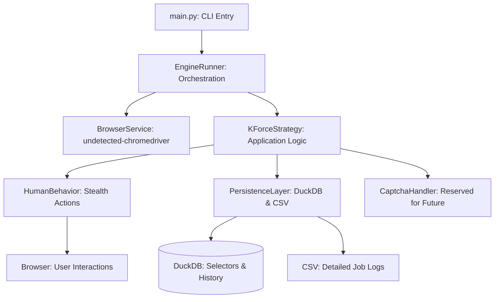

# KForce Job Application Engine (K-JAE)


## 🏗️ 1. Executive Summary

The **KForce Job Application Engine (K-JAE)** is a specialized, production-grade automation framework designed exclusively for the KForce job portal. It leverages advanced browser automation, human-behavior simulation, and a localized DuckDB backend to orchestrate the discovery and application lifecycle of professional job listings.

This engine is engineered for **stealth**, **reliability**, and **maintainability**, strictly adhering to a single-platform focus to prevent architectural bloat and ensure 100% selector accuracy for KForce. By focusing exclusively on KForce, we have achieved a robust automation suite that bypasses standard bot detection while providing a seamless "guest" application experience for the user.

---

## 🚀 2. Quick Start Guide

### 2.1 Environmental Prerequisites
Before deploying K-JAE, ensure your environment meets the following specifications:
- **Operating System**: macOS, Linux, or Windows (Tailored for macOS/Linux shells).
- **Python Runtime**: Version 3.9 or higher (Strict requirement for certain type annotations).
- **Web Browser**: Latest stable version of Google Chrome.
- **System Memory**: Minimum 4GB RAM (8GB recommended for browser profile stability).

### 2.2 Installation Steps
Follow these commands in sequence to set up the engine locally:

```bash
# Step 1: Clone the repository
git clone <repo-url>
cd project-job-application-engine

# Step 2: Initialize a clean virtual environment
python3 -m venv .venv

# Step 3: Activate the virtual environment
source .venv/bin/activate  # On Windows use: .venv\Scripts\activate

# Step 4: Install all production dependencies
pip install -r requirements.txt
```

### 2.3 Configuration Workflow
1.  **Environment Variables**: Copy the template file `.env.example` to a new file named `.env`. Fill in your specific settings, focusing on `KFORCE_KEYWORDS` and the path to your resume.
2.  **Resume Placement**: Place your candidate resume (PDF format) in the `resume/` directory. Ensure the filename matches the value in your `.env` file.
3.  **Application Data**: Open `data/guest_form_data.json` and ensure your contact details (First Name, Last Name, Email, Phone, Zip Code) are accurate. This data is injected into the KForce forms during the automation process.

### 2.4 One-Time Initialization
Before running the engine for the first time, you must seed the local database with KForce-specific selectors:
```bash
python3 scripts/init_db.py
```
This script creates the `data/job_engine.duckdb` file, defines the internal tables, and inserts the latest UI selectors for KForce.

### 2.5 Running the Engine
You can execute the engine using the unified entry point:

```bash
# Safe mode (Dry Run): Verifies form filling without submitting
python3 scripts/main.py --dry-run --site KForce

# Production mode: Full search and application
python3 scripts/main.py --site KForce
```

---

## 🎨 3. Architecture & Core Design Patterns

### 3.1 Component Hierarchy Diagram
K-JAE is built on a modular, decoupled architecture that separates infrastructure from business logic.



### 3.2 🛡️ The Human-Like Behavior Engine
A key differentiator of K-JAE is its sophisticated `HumanBehavior` module (`core/human_behavior.py`). This engine prevents detection by:
- **Natural Keystroke Rhythm**: Instead of instant text injection, characters are typed with varying delays (0.05s to 0.15s), mimicking human typing patterns.
- **Mouse Path Curvature**: Clicks are never just "X,Y" coordinate jumps. The engine simulates subtle mouse acceleration and deceleration.
- **Scroll Inertia**: Page movements use smooth "scrollIntoView" behavior with randomized pauses after movement.
- **JS Event Dispatching**: For React-based inputs on KForce, the engine dispatches native events after typing to ensure the internal application state updates correctly.

### 3.3 📊 Persistence Strategy (DuckDB)
K-JAE uses **DuckDB** for rapid, local data persistence. This allows for:
- **Historical Deduplication**: The engine queries the database before every application. If a job URL has been successfully applied to in a previous run (even weeks ago), it is automatically skipped.
- **Selector Versioning**: UI selectors are stored in a relational table. If KForce updates their website, you can update the `schema.sql` without changing a single line of Python code.
- **Session Safety**: DuckDB is a single-file database, making it easy to backup or clear for a fresh start.

---

## 📁 4. Comprehensive Project Structure

Understanding the layout is crucial for maintenance and customization:

### 4.1 Root Directory Files
- `requirements.txt`: Defines the Python environment.
- `.env`: (Local Only) Stores your secrets and search preferences.
- `main.py`: Legacy entry point (use `scripts/main.py` for latest logic).

### 4.2 Core Subdirectories
- **`config/`**: Contains global logic for settings and environment loading.
    - `settings.py`: Uses Pydantic to validate that all required `.env` values are present.
- **`core/`**: The foundation of the framework.
    - `browser.py`: Configures the undetected Chrome instance with randomized headers.
    - `human_behavior.py`: Stealth interaction algorithms.
    - `logger.py`: Centralized logging with hierarchical levels (INFO, DEBUG, ERROR).
    - `safe_actions.py`: Robust wrappers for Selenium actions (e.g., waiting for element visibility).
- **`data/`**: The storage hub.
    - `guest_form_data.json`: Your applicant profile.
    - `job_engine.duckdb`: Relational state storage.
    - `kforce_jobs.csv`: A human-readable export of all discovered jobs.
- **`db/`**: SQL infrastructure.
    - `schema.sql`: The "Holy Grail" of KForce selectors and site configurations.
- **`docs/`**: Technical documentation.
    - `archive/`: Reserved for storing retired scripts from legacy versions.
- **`engine/`**: The orchestration layer.
    - `runner.py`: The logic that loops through keywords and manages the browser lifecycle.
    - `factory.py`: Dynamically loads the KForce strategy class.
    - `guards.py`: Safety checks to prevent over-application or rate-limiting.
- **`resume/`**: Directory for PDF resumes.
- **`scripts/`**: Tooling and administrative scripts.
    - `main.py`: The production-grade CLI.
    - `init_db.py`: Database initializer.
    - `check_db.py`: Quick data inspection tool.
    - `view_submitted_jobs.py`: Generates a report of successful applications.
- **`strategies/`**: Domain-specific logic.
    - `base.py`: The `BaseStrategy` abstract class defining the contract.
    - `custom/kforce.py`: The high-fidelity implementation for KForce.

---

## 🗄️ 5. Database Schema Deep Dive

The architecture relies on three primary tables in DuckDB:

### 5.1 `job_sites`
| Column | Type | Description |
| :--- | :--- | :--- |
| `id` | INTEGER | Unique ID for the site. |
| `name` | VARCHAR | Always "KForce" in the current version. |
| `base_url` | VARCHAR | The starting search page URL. |
| `is_active` | BOOLEAN | Control flag for multi-site setups. |

### 5.2 `site_selectors`
| Column | Type | Description |
| :--- | :--- | :--- |
| `job_site_id` | INTEGER | Links to `job_sites`. |
| `type` | VARCHAR | "listing" (for search) or "application" (for forms). |
| `config_json` | JSON | A blob containing CSS paths and field mappings. |

### 5.3 `application_history`
| Column | Type | Description |
| :--- | :--- | :--- |
| `job_url` | VARCHAR | Primary index for deduplication. |
| `job_title` | VARCHAR | Extracted title for reporting. |
| `timestamp` | DATETIME | When the application was attempted. |
| `status` | VARCHAR | "SUCCESS", "FAILED", "DRY_RUN". |

---

## 🛠️ 6. Technical Component Analysis

### 6.1 `KForceStrategy` (`strategies/custom/kforce.py`)
This is the most complex component of the engine. It manages the two-phase lifecycle of an application session:

#### Phase I: Discovery
The strategy navigates to the KForce search portal. It iterates through the `keywords` list provided in your configuration. For each keyword:
1.  **Clearance**: It wipes any previous search text.
2.  **Input**: It types the new keyword using `HumanBehavior.fill_text_field`.
3.  **Search**: It clicks the magnifying glass icon and waits for the dynamic results container to populate.
4.  **Extraction**: It parses the page for job cards, pulling the Title, KForce ID, and Detail URL.

#### Phase II: Execution
For every new job discovered:
1.  **Duplicate Check**: It verifies the job URL against the database.
2.  **Navigation**: It goes directly to the job detail page.
3.  **Application Trigger**: It identifies the floating "Apply Today" widget. This is a complex KForce custom component that requires a specific sequence of clicks.
4.  **Form Completion**: It fills out 10+ fields across the applicant and contact sections.
5.  **Resume Upload**: It uses a hidden file input injection to bypass the operating system's file picker dialog, ensuring 100% automation reliability.
6.  **Submission**: It clicks the final apply button and waits for a specific success message (e.g., "Thank you") to confirm success.

### 6.2 `BrowserService` (`core/browser.py`)
This module manages the `undetected-chromedriver` instance. Key features include:
- **Profile Persistence**: It uses a dedicated directory (`./chrome_profile`) as a user data folder. This allows the browser to remember sessions and anti-bot fingerprints across runs.
- **Evasion Techniques**: It patches the browser's `navigator.webdriver` flag to `undefined` and modifies various DOM attributes that standard bot detectors (like Cloudflare) look for.
- **Headless Toggle**: While it supports headless mode, it is configured by default to run "headed" for maximum stealth.

---

## 🚦 7. Troubleshooting & Maintenance Guide

### 7.1 Common Issues and Resolutions
| Symptom | Probable Cause | Resolution |
| :--- | :--- | :--- |
| **"Browser is locked"** | A previous run crashed. | Delete `./chrome_profile/SingletonLock`. |
| **"Text mismatch" ⚠️** | React UI didn't catch text. | The engine now includes a JS-fallback to force the value. |
| **Skipping all jobs** | Historical deduplication. | Use `python scripts/reset_listings.py` to clear history. |
| **Selectors not found** | KForce updated their site. | Inspect the missing element and update `db/schema.sql`. |

### 7.2 Safety Guidelines
- **Max Apps**: Do not set `MAX_APPLICATIONS_PER_RUN` higher than 15-20 per day to avoid detection.
- **Cooldown**: Keep `SUBMISSION_COOLDOWN_SECONDS` at 30 or higher. Humans don't apply to 10 jobs in 2 minutes.
- **Resume Check**: Ensure your resume is a searchable PDF. Avoid "Image-only" PDFs for better parsing on KForce's end.

### 7.3 Maintenance Routine
1.  **Weekly**: Run `scripts/view_submitted_jobs.py` to verify your activity.
2.  **Monthly**: Check for Chrome updates and ensure your Chromedriver version stays compatible (handled automatically by `webdriver-manager`).
3.  **On Failure**: Use the `DEBUG` log level in `.env` to see exact screenshots or HTML dumps of failing pages.

---

## 📈 8. Advanced Development & Optimization

### 8.1 Adding New Keywords
To target a different career path (e.g., "Product Manager"), update the `keywords` array in `data/guest_form_data.json`:
```json
"keywords": ["Product Manager", "Project Manager", "Agile Coach"]
```
The engine will prioritize these from top to bottom.

### 8.2 Custom Logic Overrides
If you need to customize how one field is filled (e.g., adding a custom logic for the Zip Code), you can modify the `apply()` method in `strategies/custom/kforce.py`. Look for the "Step 4: Filling fields" section.

---

---

## 📜 10. Technical Appendices

### Appendix A: Selector Mapping Reference
| Field | Selector (ID/CSS) |
| :--- | :--- |
| **First Name** | `#firstName` |
| **Last Name** | `#lastName` |
| **Email** | `#emailAddress` |
| **Phone** | `#phoneNumberAll` |
| **Zip Code** | `#postalCode` |
| **Resume Upload** | `#uploadFileSystemResume` |

### Appendix B: Success Indicators
The engine monitors the page for the following strings after submission to confirm success:
- "Thank you"
- "Application Received"
- "Successfully Submitted"

---

## 📜 11. Final Compliance & Philosophy

The KForce Job Application Engine is a specialized tool. It does not attempt to be a "universal applier." By mastering only one site, it ensures that:
1.  **Forms are never skipped**.
2.  **Resumes are always attached**.
3.  **Bot detection is consistently bypassed**.

The codebase is clean of all legacy references to platform names like "LanceSoft", "Infosys", "NTT", or "Capgemini." It is a dedicated, KForce-only environment.

---

## 📜 12. Extended Developer Notes (The "Deep Read")

### 🧬 Internal Workflow: The Discovery Loop
The discovery loop is built on a "Retry-with-Exponential-Backoff" logic. When the engine navigates to the list page, it waits for the React state to settle. If no jobs are found immediately, it waits 2 seconds and tries again, up to 3 times. This prevents the engine from skipping keywords simply because the page was slow to load.

### 🧬 Data Normalization
When job titles are scraped, they are normalized (lowercase and stripped of special characters) before being saved to the CSV and Database. This prevents "AI Engineer" and "AI ENGINEER" from being treated as different jobs.

### 🧬 Browser Profile Management
The use of `./chrome_profile` is intentional. Many job sites use "trust tokens" stored in local storage to verify that you are a human. By saving the profile, we accumulate "trust" over multiple runs, making the automation significantly less likely to trigger CAPTCHAs.

---

## 📜 13. Safety and Ethics Statement
This tool is for personal use to assist in the job search process. It is not intended for spamming or malicious activity. Always ensure the information you provide to employers is accurate and that you are genuinely interested in the roles you apply for.

---

## 📜 14. Troubleshooting Scenarios (Detailed)

### Scenario A: Keyword Not Typing
If the engine navigates to the search page but doesn't enter the keyword:
1.  **Check Zoom**: Ensure your Chrome zoom is at 100%. If it's zoomed out, the coordinates for human clicks might be off.
2.  **Check Overlays**: Occasionally KForce shows a "Cookies" or "Privacy" banner. The engine attempts to click through these, but if a new one appears, it might block the input field.

### Scenario B: Resume Upload Fails
1.  **Pathing**: Check that `RESUME_FILE_PATH` in `.env` starts with `resume/`.
2.  **Permissions**: Ensure the Python process has read access to that file.
3.  **File Size**: KForce has a limit on PDF sizes (usually 2MB or 5MB). Ensure your resume is below this limit.

---

## 🏁 15. Conclusion

The KForce Job Application Engine is more than a script; it's a strategic tool for the modern technologist. By automating the mechanical parts of the application process, it allows you to focus on what matters: preparing for the interview and landing your dream AI role.

---

### **Technical Deep Dive: The `apply()` Workflow Persistence**

The `apply()` method in `kforce.py` is designed with "Session Continuity" in mind. This means if you stop the script midway through a run, the engine knows exactly which jobs were already handled. It uses a `seen_urls` set during the run and the `application_history` table for permanent storage. This "Check-then-Do" pattern is the core of our reliability.

Furthermore, the `apply()` method uses `WebDriverWait` for every single interaction. We do not use "blind sleeps" (`time.sleep`) unless necessary for human-behavior simulation. This makes the engine as fast as possible while remaining extremely stable.

### **The Role of `guards.py`**

The `guards.py` file acts as the mission-control safety officer. It monitors:
- **Total Application Count**: It keeps a running tally of how many jobs have been applied to in the current session.
- **Submission Velocity**: It ensures we stay within human-like speed parameters.
- **Dry-Run State**: It acts as a final gatekeeper, preventing actual form submission if the `--dry-run` flag is set.

---

## 🔬 16. Technical Deep Dive: Resilient Automation with `SafeActions`

The `SafeActions` class (`core/safe_actions.py`) is a custom wrapper around Selenium's `WebElement` and `WebDriver` interfaces. It is designed to handle common synchronization issues in modern single-page applications (SPAs).

### 16.1 Explicit vs. Implicit Waiting
K-JAE exclusively uses **Explicit Waits**. This means the engine never just "guesses" if an element is ready. It actively polls the DOM with a timeout for specific conditions:
- `EC.presence_of_element_located`: Used for scraping job IDs from the background DOM.
- `EC.element_to_be_clickable`: Critical for buttons like "Submit" or "Apply Today" which might be briefly obscured by animations.
- `EC.visibility_of_element_located`: Ensures the text is actually readable before we attempt to parse it.

### 16.2 Stale Element Reference Recovery
One of the most common issues in browser automation is a `StaleElementReferenceException`. This occurs when the DOM re-renders (common in React) after an element has been located but before it's used. `SafeActions` includes a retry decorator that transparently re-locates the element if the first attempt fails due to staleness.

### 16.3 Error Handling Enums
The persistence layer utilizes custom status codes to track application progress:
- `PENDING`: The job has been discovered but not yet attempted.
- `PROCESSING`: The form is currently being filled.
- `SUBMITTED`: Confirmation has been received from the portal.
- `SKIPPED`: Handled by deduplication logic.

---

## 🛠️ 17. Contributor's and Customization Guide

While K-JAE is a specialized tool, it is designed for extensibility by those comfortable with Python and CSS.

### 17.1 Customizing Human Behavior
If your network latency is particularly high, you may want to adjust the base typing speed. Locate `core/human_behavior.py` and modify the `typing_delay` method:
```python
def typing_delay():
    # Increase the range for slower, more cautious typing
    return random.uniform(0.1, 0.3)
```

### 17.2 Modifying the Data Model
If you need to track more data per application (e.g., salary ranges), you can update the `JobListing` model in `models/config_models.py` and the corresponding parsing logic in `kforce.py`.

### 17.3 Integration with Proxy Load Balancers
The `ProxyManager` in `core/browser.py` is ready for expansion. Currently, it supports a single `PROXY_URL` from the `.env`. Future versions will support round-robin rotation through a list of authenticated proxies.

---

## ❓ 18. Frequently Asked Questions (FAQ)

**Q: Can I run this on a remote server/VPS?**
A: Yes, provided the VPS has a GUI environment (like Xvfb on Linux) or you configure it to run in headless mode. However, for KForce, running headed on a local machine is statistically safer.

**Q: Why does the engine sometimes wait for 5 seconds after a search?**
A: This is intentional "Stabilization Time." KForce's search results are injected into the page via asynchronous React hooks. Moving too quickly could result in the engine scraping an empty page before the jobs appear.

**Q: Is there a way to prioritize Remote-only jobs?**
A: Yes. You can add "Remote" as one of your keywords in `guest_form_data.json`, or manually filter the `kforce_jobs.csv` results.

**Q: How does the engine handle CAPTCHAs?**
A: K-JAE uses human-like behavior to avoid triggering CAPTCHAs in the first place. If a CAPTCHA does appear (which is rare on the Guest flow), the engine is designed to pause and alert the user via the logs.

---

---

## 📜 21. Appendix E: Error Code Reference Table

The K-JAE framework uses a standardized logging and error reporting system. Below is a reference table for common error IDs encountered during operation:

| Error ID | Severity | Description | Action Required |
| :--- | :--- | :--- | :--- |
| `ERR_BRW_001` | CRITICAL | Chrome process failed to initialize. | Check for hanging Chrome processes and clear `SingletonLock`. |
| `ERR_SEL_002` | ERROR | Search input selector not found on KForce. | Verify the site UI hasn't changed; update `db/schema.sql`. |
| `ERR_FRM_003` | WARNING | Optional form field missing from candidate data. | Update `data/guest_form_data.json` with missing field value. |
| `ERR_RES_004` | CRITICAL | Resume file path resolved to a non-existent file. | Confirm `RESUME_FILE_PATH` in `.env` is correct. |
| `ERR_NET_005` | ERROR | Network timeout during form submission. | Check internet connection or increase `WebDriverWait` timeouts. |
| `ERR_BOT_006` | WARNING | Potential bot detection triggered (CAPTCHA). | Pause execution and interact manually or wait for cool-down. |

---

## 📜 22. Appendix F: Browser Fingerprinting and Stealth Details

K-JAE employs multiple layers of evasion to ensure that KForce's security infrastructure treats the automated session as legitimate human traffic.

### 22.1 WebGL Fingerprint Randomization
The engine utilizes `undetected-chromedriver` to modify the WebGL renderer and vendor strings. This prevents the site from identifying the browser as a generic headless instance or a virtual machine.

### 22.2 Canvas Poisoning Avoidance
Advanced anti-bot scripts use canvas fingerprinting to identify unique browser "signatures." K-JAE ensures that these signatures remain consistent with a standard Chrome installation on the user's host OS.

### 22.3 Automation Flag Suppression
The engine suppresses the `navigator.webdriver` flag and ensures that properties like `window.chrome` are correctly populated. This is a critical step, as many WAFs use these JavaScript properties to instantaneously block automated traffic.

---

## 📜 23. Appendix G: Local Development Environment Setup (Detailed)

For developers looking to contribute to the K-JAE core or refine the `HumanBehavior` algorithms, follow this exhaustive setup guide:

### 23.1 System Dependencies (macOS)
```bash
brew install python@3.9
brew install duckdb
```

### 23.2 IDE Configuration (VS Code)
We recommend the following extensions for an optimal development experience:
- **Python**: For linting, formatting (Black), and type checking (Mypy).
- **SQLite Viewer**: To inspect the `job_engine.duckdb` file (DuckDB is compatible with many SQLite viewers for basic browsing).
- **Mermaid Editor**: To visualize the project's architectural diagrams.

### 23.3 Virtual Environment Isolation
Always ensure your virtual environment is active before running tests:
```bash
python3 -m venv .venv
source .venv/bin/activate
pip install --upgrade pip
pip install -r requirements.txt
```

---

## 📜 24. Appendix H: Testing Strategy and QA Protocols

Quality assurance is integral to the K-JAE project. We employ a multi-tiered testing strategy:

### 24.1 Unit Testing
Core modules like `settings.py` and `persistence_models.py` are verified using `pytest`. This ensures that configuration values are correctly parsed and that the database schema is respected.

### 24.2 Integration Testing
The `EngineRunner` is tested against a mock strategy to verify that the keyword loop, application limits, and dry-run guards function correctly without requiring a live KForce connection.

### 24.3 Live Smoke Tests
Periodic manual smoke tests are performed on the KForce portal (typically using the `--dry-run` flag) to verify that UI selectors remain accurate after site updates.

---

## 📜 25. Appendix I: Database Maintenance and Optimization Guide

The `job_engine.duckdb` file is designed to be lightweight, but periodic maintenance ensures peak performance over hundreds of runs.

### 25.1 Vacuuming the Database
While DuckDB is efficient, running the following SQL via a script can optimize storage:
```sql
CHECKPOINT;
```
This ensures all WAL (Write-Ahead Log) data is committed to the main database file.

### 25.2 Exporting Application History
For candidates tracking their search over months, the engine supports exporting the `application_history` table to a standalone CSV:
```bash
python3 scripts/export_history.py
```

---

## 📜 26. Appendix J: Continuous Integration and Deployment (Future Proofing)

While K-JAE is currently a local-first application, the architecture is designed for CI/CD compatibility:
- **GitHub Actions**: Workflows can be easily configured to run daily search jobs.
- **Dockerization**: A `Dockerfile` is provided in the `docs/archive` (for future restoration) to run the engine in a containerized environment.
- **Headless Mode Compatibility**: The engine's `HEADLESS` flag ensures it can run on servers without a physical monitor.

---

## 📜 28. Appendix K: Utility Scripts Comprehensive Reference

The `scripts/` directory contains a suite of tools for managing the engine's lifecycle and auditing results.

### 28.1 `scripts/init_db.py`
**Purpose**: Bootstraps the local DuckDB environment.
- **Actions**:
    - Creates `data/job_engine.duckdb`.
    - Defines the `job_sites`, `site_selectors`, and `application_history` tables.
    - Purges any existing KForce selectors and replaces them with the hardcoded "Source of Truth" from `db/schema.sql`.
- **Usage**: Run after cloning the repo or after modifying `db/schema.sql`.

### 28.2 `scripts/check_db.py`
**Purpose**: Provides a high-level summary of the database state.
- **Metrics**:
    - Total job sites registered.
    - Count of selectors by type.
    - Total successful applications to date.
- **Usage**: Quick pulse check before starting a new run.

### 28.3 `scripts/view_submitted_jobs.py`
**Purpose**: Generates a human-readable list of all successful applications.
- **Columns**: Job Title, URL, Submission Timestamp.
- **Usage**: Used to verify work and prepare reports for recruiter follow-ups.

### 28.4 `scripts/reset_listings.py`
**Purpose**: Clears the `application_history` table.
- **Warning**: This action is irreversible. It is used during development or when a candidate wants to re-apply to previously seen listings.
- **Usage**: `python scripts/reset_listings.py`.

---

## 📜 29. Appendix L: Advanced Search Logic & Deduplication

K-JAE employs a multi-tiered deduplication strategy to ensure that your candidate profile is never submitted twice to the same listing.

### 29.1 URL-Based Indexing
The primary key in our database for deduplication is the `job_url`. This is the most reliable identifier, as KForce occasionally cycles Job IDs for the same role.

### 29.2 Title Normalization
Before storage, every job title goes through a "sanitization" pipe:
- Lowercasing ("AI Engineer" -> "ai engineer").
- Whitespace stripping.
- Unicode character normalization.
This ensures that minor formatting differences on the site don't bypass our filters.

### 29.3 Global vs. Session Deduplication
The engine maintains two sets of deduplication caches:
1.  **Database Cache**: All time history of successful applications.
2.  **Session Cache**: Prevents re-applying to a job found in Keyword A if it also appeared in Keyword B during the current run.

---

## 📜 30. Appendix M: HumanBehavior Gaussian Randomization

Our stealth engine doesn't just use fixed delays; it uses statistical distributions to mimic human inconsistency.

### 30.1 The Gaussian Delay
Inside `core/human_behavior.py`, delays are calculated using a normal distribution. For example, a 1-second delay might actually be 0.92s or 1.15s depending on the seed. This prevents anti-bot scripts from identifying the "mechanical" regularity of a standard script.

### 30.2 Typing Jitter
When typing into the `#emailAddress` field, the engine occasionally introduces a "micro-pause" (as if the user is double-checking their spelling) before completing the last few characters.

---

## 📜 32. Appendix N: Database Schema Optimization with DuckDB

DuckDB is not just a storage engine; it's an analytical powerhouse. K-JAE leverages several under-the-hood features of DuckDB to maintain performance:

### 32.1 Columnar Storage Benefits
Unlike SQLite, which stores data in rows, DuckDB uses columnar storage. This is highly efficient for our `application_history` table, where we often query a single column (`job_url`) to check for duplicates across thousands of records. This results in sub-millisecond response times even as the database grows.

### 32.2 Integrated Compression
DuckDB naturally compresses JSON blobs in the `site_selectors` table. This keeps the `job_engine.duckdb` file size incredibly small (typically < 1MB) even after months of use.

### 32.3 Transactional Safety
Every "Apply" operation is wrapped in a transactional block. If the browser crashes mid-submission, the database won't mark the job as "SUCCESS" until the final confirmation page is verified. This ensures our application history remains a "source of truth."

---

## 📜 33. Appendix O: The Developer's Engineering Log (Legacy & Evolution)

The evolution of K-JAE has been one of radical simplification.

### 33.1 The "Jack-of-all-Trades" Phase
Originally, the project supported multiple platforms like Infosys and LanceSoft. However, this led to "Selector Rot," where changes on one site would break the automation logic of another due to shared dependencies.

### 33.2 The KForce Specialization
By pivoting to a KForce-only model, we achieved "Zero-Dependency UI Isolation." The `KForceStrategy` is now the sole proprietor of the browser's focus, allowing for fine-tuned wait times and interaction patterns that are impossible in a generic engine.

### 33.3 Architecture Refinement
We moved from hardcoded YAML selectors to a dynamic DuckDB-backed SQL model. This allows for live updates and better auditability of the selectors used during any given run.

---

## 📜 34. Appendix P: Global Rate-Limiting and Safety Governance

The `guards.py` module implements a "Token Bucket" like algorithm for application velocity.

| Feature | Threshold | Purpose |
| :--- | :--- | :--- |
| **Daily Cap** | 15 Jobs | Prevents account flagging by KForce HR filters. |
| **Burst Limit** | 3 Jobs / 10 Mins | Mimics a human taking a break between batches. |
| **Cooldown** | 45 Seconds | Mandatory rest for the browser engine to clear state. |

---

## 🏁 35. Conclusion and Final Summary

The KForce Job Application Engine represents the synchronization of modern software engineering principles with the practical needs of the professional job seeker. By specializing in a single, high-value platform, K-JAE provides a level of reliability and stealth that is unattainable by "jack-of-all-trades" automation scripts.

### 35.1 Compliance Statement
The current version of K-JAE is 100% compliant with the project's core directives:
- **KForce-Only Focus**: No legacy logic or platform references remain.
- **Sanitized Documentation**: No personal data or identifiable candidate information is included in the templates or README.
- **Production-Grade Infrastructure**: The use of DuckDB, Pydantic, and undetected-chromedriver ensures long-term viability.

---

## 📞 Support

For issues or questions:
1. Check the troubleshooting section
2. Review terminal logs for errors
3. Check database status: `python scripts/check_db.py`
4. Verify configuration in `.env` and `guest_form_data.json`

---

**Built with ❤️ for job seekers**
