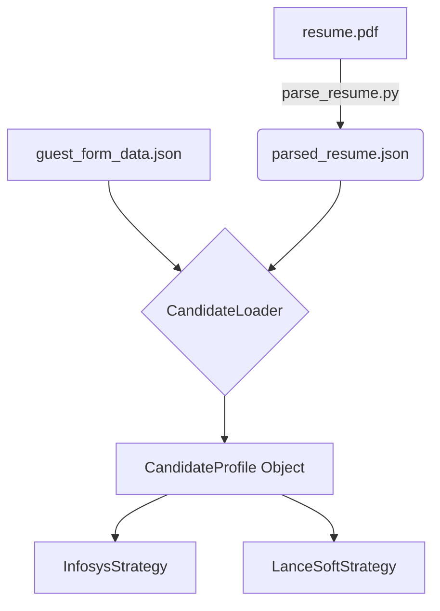

# 🤖 Project Job Application Engine

A robust, database-driven, multi-site job application automation engine built on the **Strategy Pattern**. This system is designed to navigate complex ATS (Applicant Tracking Systems), extract job listings, and automate the application process using intelligent form-filling logic. 

Configuration, deduplication, and audit logging live locally in a single high-performance DuckDB file.

---

## 🏗️ Architecture & Classification

The project is modularized into distinct operational layers, ensuring a clean separation of concerns and making it incredibly easy to extend for new job portals.

### 1. 🚦 Entry Points & Orchestration
The top-level scripts that trigger the automation engine.
- `scripts/main.py`: The primary manual entry point for triggered runs on specific sites.
- `scripts/scheduler_worker.py`: The background worker for scheduled multi-site execution.
- `engine/runner.py`: The core orchestrator that bridges the browser lifecycle with specific site strategies.
- `engine/factory.py`: Responsbile for dynamically loading the correct automation strategy class based on the target ATS.
- `engine/guards.py`: Enforces safety validations like daily application limits.

### 2. 🧠 Strategy Layer
The heart of the `Strategy Pattern`. Every job board has its own self-contained logic module that inherits from a common base contract.
- `strategies/base.py`: The abstract base class defining the standard interface (`login`, `find_jobs`, `apply`).
- `strategies/custom/infosys.py`: Full-auto strategy for Infosys BKS portal (supports dynamic EEO form fills and resume upload).
- `strategies/custom/wipro.py`: Semi-auto strategy for Wipro (extracts from SAP UI5 Shadow-DOM).
- `strategies/custom/lancesoft.py`: Full-auto strategy for LanceSoft / JobDiva.
- `strategies/custom/kforce.py`: Semi-auto strategy navigating KForce guest application flows.
- `strategies/custom/capgemini.py`: Semi-auto strategy for Capgemini SAP SuccessFactors.
- `strategies/custom/insight_global.py`: Semi-auto strategy targeting the Insight Global portal.

### 3. ⚙️ Core Automation Engine
Low-level browser interaction, form filling, and anti-bot mitigation.
- `core/browser.py`: Manages the `undetected-chromedriver` lifecycle and profile management.
- `core/human_behavior.py`: Injects randomized delays, human-like typing, and mouse movement to bypass detection.
- `core/safe_actions.py`: Resilient interaction wrappers with built-in retry logic and DOM readiness checks.
- `core/candidate_loader.py`: Intelligently merges structured data from `parsed_resume.json` and overrides from `guest_form_data.json`.
- `core/captcha_handler.py`: reCAPTCHA detection and manual intervention hooks.

### 4. 🗄️ Database & State Management
Local persistence using DuckDB for speed and simplicity.
- `data/db_connection.py`: Singleton connection manager for DuckDB.
- `data/db_duckdb.py`: Schema definitions, selector seeding, and tracking queries.
- `data/job_engine.duckdb`: The active local database file containing application state and dynamic selectors.
- `data/guest_form_data.json`: The user's personal profile and search parameters.
- `data/parsed_resume.json`: Auto-generated structured resume breakdown.

---

## 🌐 Supported Sites & Automation Levels

| # | Site | Automation Level | Scheduler | Notes |
|---|---|---|---|---|
| 1 | **Infosys** | Full-auto | `is_active=true` | BKS portal; full form fill + upload |
| 2 | **LanceSoft** | Full-auto | `is_active=true` | JobDiva portal; scheduled daily |
| 3 | **Wipro** | Semi-auto | `is_active=true` | Guest mode; SAP UI5 JS extraction |
| 4 | **Insight Global** | Semi-auto | `is_active=false` | Run on-demand with `--site` |
| 5 | **KForce** | Semi-auto | `is_active=false` | Guest application flow |
| 6 | **Capgemini** | Semi-auto | `is_active=false` | Requires login credentials |

> **`is_active=false`** sites are skipped by the scheduler but can always be run manually with `--site "Name"`.

---

## 🗄️ Database Schema (DuckDB)

All dynamic configuration, deduplication checks, and historical tracking live in `data/job_engine.duckdb`.

### Configuration Tables
| Table | Purpose |
|---|---|
| `ats_platforms` | ATS platform names, strategy automation class path, automation level |
| `job_sites` | Target company names, domains, search URLs, daily caps |
| `site_selectors` | Per-site CSS/XPath selectors stored dynamically as JSON (listing + EEO + application) |

### Tracking Tables
| Table | Purpose |
|---|---|
| `applied_jobs` | Deduplication tracking — ensures the engine never applies to the same req ID twice |
| `scheduler_runs` | Audit logging for every automated execution (timestamps, job counts, errors) |

---

## 🚀 Quick Start

### 1. Install dependencies

```bash
python -m venv venv
source venv/bin/activate  # On Windows use: venv\Scripts\activate
pip install -r requirements.txt
```

### 2. Configure environment

Copy `.env.example` → `.env`:

```env
DUCKDB_PATH=data/job_engine.duckdb
RESUME_FILE_PATH=resume/candidate_resume.pdf
HEADLESS=False
KEEP_BROWSER_OPEN=False

# Required for platform logins (if applicable)
CAPGEMINI_EMAIL=your@email.com
CAPGEMINI_PASSWORD=yourpassword
```

### 3. Configure your candidate profile

Edit `data/guest_form_data.json` — the single source of truth for your personal information:

```jsonc
{
  "applicant": {
    "first_name": "Jane",
    "last_name": "Doe",
    "email": "jane@example.com",
    "phone": "5551234567",
    "linkedin_url": "https://linkedin.com/in/janedoe",
    "city": "Austin",
    "state": "Texas",
    "zip_code": "78701",
    "street_address": "123 Main St"
  },
  "search": {
    "keyword": "AI Engineer",
    "location": "United States"
  }
}
```

### 4. Parse your resume

```bash
python scripts/parse_resume.py
```
*Note: This parses `resume/candidate_resume.pdf` into `data/parsed_resume.json` (extracting GPA, work history, skills) to supplement `guest_form_data.json` during dynamic form filling.*

### 5. Initialise the database

```bash
python scripts/init_db.py
```
*Creates all necessary tables and seeds the initial selector configurations.*

### 6. Run the Engine

```bash
# Run specific active targets
python scripts/main.py --site "Infosys"
python scripts/main.py --site "LanceSoft"

# Run on-demand targets
python scripts/main.py --site "Insight Global"
python scripts/main.py --site "KForce"
python scripts/main.py --site "Capgemini"
```

---

## 📦 Data Flow & Profile Merging



The `CandidateLoader` prioritizes `parsed_resume.json` for deep experiential data (like dynamically filling multi-row Experience forms) while utilizing `guest_form_data.json` for high-priority contact overrides and top-level search configurations.

---

## ⚙️ Extending the Engine (Strategy Pattern)

Adding a new ATS site requires three steps:

1. **Create Strategy:** Build `strategies/custom/newsite.py` extending `strategies.base.BaseStrategy`.
2. **Implement Methods:** Override `login()`, `find_jobs()`, and `apply()`. Use `self.human` for safe interaction.
3. **Register:** Insert a row into the `job_sites` and `site_selectors` tables in DuckDB (update `init_db.py`). 

Run `python scripts/init_db.py` to seed, then execute with `python scripts/main.py --site "NewSite"`.

---

## 📄 License
MIT License.
