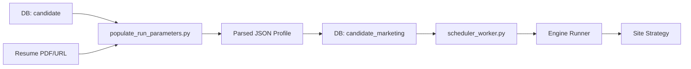

# 🤖 Job Application Engine

A state-of-the-art, database-driven job application automation engine. This system is designed to handle the end-to-end lifecycle of job discovery and application, scaling from manual one-off tests to fully automated schedule-based marketing campaigns for multiple candidates.

---

## 🏗️ System Architecture

The engine uses a **Strategy Pattern** to decouple the core execution logic from site-specific navigation and form-filling logic.

### 📂 Component Breakdown
- **`core/`**: The foundation. Handles browser lifecycle (`browser.py`), randomized human behavior (`human_behavior.py`), and complex interactions (`safe_actions.py`).
- **`engine/`**: The orchestrator.
    - `runner.py`: Coordinates between the database, browser, and strategies.
    - `factory.py`: Dynamically loads strategies based on the `ats_platforms` configuration.
    - `guards.py`: Enforces safety limits to protect accounts from being flagged as bots.
- **`models/`**: SQLAlchemy-based data layer for configuration (MySQL) and historical tracking.
- **`strategies/custom/`**: Individual automation logic for sites like **Wipro**, **Infosys**, **LanceSoft**, **Insight Global**, and more. Each handles its own page navigation and selector interaction.

---

## 🧬 Candidate Marketing Pipeline

This is the core "Business Logic" of the engine, managing how candidate data flows from a database record to a successful job application.

### 1. The Data Model
- **`candidate`**: Primary table containing personal info (Name, Email, Phone, Address).
- **`candidate_marketing`**: The automation control center.
    - `marketing_flag`: Set to `1` to enable automation for this candidate.
    - `is_processed`: Tracks if the candidate has been handled in the current cycle.
    - `run_parameters`: A critical JSON field storing the parsed profile used for form-filling.

### 2. The Data Lifecycle


### 3. Population & Parsing (`populate_run_parameters.py`)
This script bridges the gap between raw data and automation-ready profiles:
1. **Fetch**: Retrieves candidates with `status='active'` and `marketing_flag=1`.
2. **Download & Parse**: Downloads the resume from `resume_url` and uses `parse_resume.py` to extract skills and education.
3. **JSON Profile**: Constructs a sophisticated `run_parameters` JSON including:
    - Search keywords (AI, Python, etc.)
    - Form-ready personal details
    - Parsed resume data for open-text fields.

---

## 🌐 Supported Sites & Operational Guide

The engine supports various automation levels, from basic scraping to full "one-click" applications.

### 🏢 Site-Specific Commands

| Site | Platform | Test/Run Command | Key Script |
| :--- | :--- | :--- | :--- |
| **Wipro** | Custom | `python scripts/test_wipro_dry.py` | `strategies/custom/wipro.py` |
| **Infosys** | Digital | `python scripts/test_site.py --site infosys` | `strategies/custom/infosys.py` |
| **LanceSoft** | JobDiva | `python scripts/test_site.py --site lancesoft` | `strategies/custom/lancesoft.py` |
| **Insight Global** | Custom | `python scripts/test_site.py --site insight` | `strategies/custom/insight_global.py` |
| **Hiring Cafe** | Aggregator | `python scripts/scrape_hiring_cafe.py` | `strategies/custom/hiring_cafe.py` |
| **Capgemini** | Talent | `python scripts.main --site Capgemini` | `strategies/custom/capgemini.py` |

### 🛠️ Key Operational Scripts
- **`init_and_seed_integrated.py`**: Initializes the database schema and seeds site configurations.
- **`populate_run_parameters.py`**: Prepares candidate data (must be run before the scheduler).
- **`scheduler_worker.py`**: The main high-volume execution script. Queries all active/unprocessed candidates and runs them through the engine.

---

## 🚀 Getting Started

### 1. Database Initialization
```bash
python scripts/init_and_seed_integrated.py
```

### 2. Prepare Candidate Data
Ensure the `candidate_marketing` table has `marketing_flag=1` for your targets, then run:
```bash
python scripts/populate_run_parameters.py --flagged-only
```

### 3. Run Automation
```bash
# Run for all ready candidates
python scripts/scheduler_worker.py

# OR run for a specific site
python scripts/main.py --site Wipro --dry-run
```

---

## 🗄️ Database Schema Deep-Dive

### Configuration Tables
- **`ats_platforms`**: Mapping of platform names to their Python strategy classes.
- **`job_sites`**: Site-level config (domain, search URL, application limits).
- **`site_selectors`**: JSON-encoded CSS/XPath selectors for discovery and application phases.

### Tracking Tables
- **`job_listings`**: Centralized queue of discovered jobs with status tracking (`discovered`, `applied`, `failed`).
- **`applications`**: Historical log of every application attempt, including data used and error timestamps.
- **`automation_logs`**: Execution logs linked to `candidate_marketing` runs.

---

## 📄 License
MIT License.
